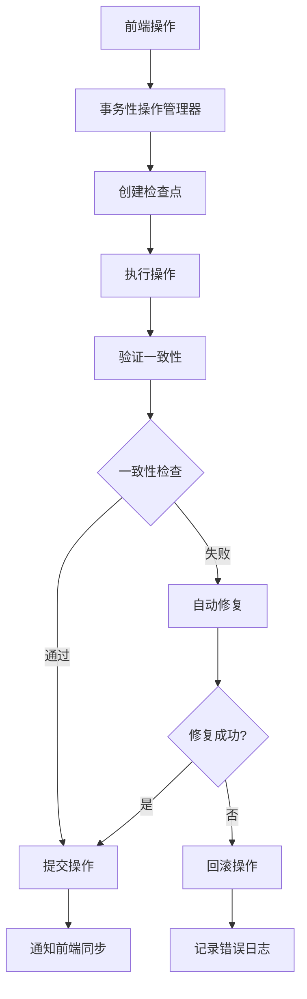

# ChromaDB前后端数据一致性保障机制

## 🎯 概述

这是一个完整的前后端数据一致性保障机制，确保ChromaDB的前端操作与后端数据状态始终保持同步。该系统提供了事务性操作、实时验证、自动修复和版本兼容性管理等功能。

## 🏗️ 系统架构

### 核心组件

1. **ConsistencyManager** - 核心一致性管理器
2. **TransactionalOperations** - 事务性操作包装器
3. **StateValidator** - 状态验证器
4. **AutoRepair** - 自动修复机制
5. **VersionManager** - 版本管理器
6. **SyncManager** - 前后端同步管理器

### 工作流程



## 🚀 快速开始

### 1. 系统集成

系统已自动集成到现有的ChromaDB管理器中。当你启动应用时，一致性保障机制会自动激活。

### 2. 前端访问

在前端添加一致性管理组件：

```typescript
import ConsistencyManager from './components/ConsistencyManager';

// 在路由中添加
{
  path: '/consistency',
  component: ConsistencyManager,
  name: '一致性管理'
}
```

### 3. API端点

所有一致性管理功能都通过 `/api/consistency` 端点提供：

- `GET /api/consistency/status` - 获取一致性状态
- `POST /api/consistency/check` - 执行一致性检查
- `POST /api/consistency/repair` - 修复一致性问题
- `POST /api/consistency/sync/force` - 强制同步
- `WebSocket /api/consistency/ws` - 实时同步通知

## 🔧 功能特性

### 1. 删除操作一致性

**问题解决**：
- 完全清理数据库元数据记录
- 删除向量文件目录
- 清理索引文件
- 验证删除完整性

**实现机制**：
```python
# 使用事务性删除
result = tx_ops.safe_delete_collection(collection_name)

# 自动验证删除结果
if result.consistency_verified:
    # 删除成功且一致性验证通过
    sync_manager.notify_frontend_operation('collection_deleted', collection_name)
```

### 2. 重命名操作一致性

**问题解决**：
- 原子性重命名操作
- 数据完整性验证
- 元数据正确更新
- 前后端状态同步

**实现机制**：
```python
# 使用事务性重命名
result = tx_ops.safe_rename_collection(old_name, new_name)

# 验证重命名结果
if result.consistency_verified:
    sync_manager.notify_frontend_operation('collection_renamed', new_name, 
                                         old_name=old_name, new_name=new_name)
```

### 3. 版本兼容性保障

**功能特性**：
- 自动检测版本变化
- 生成迁移计划
- 执行数据迁移
- 回滚机制

**使用示例**：
```python
# 检查版本兼容性
compatibility = version_manager.check_compatibility()

if compatibility["migration_needed"]:
    # 创建迁移计划
    migration_plan = version_manager.create_migration_plan()
    
    # 执行迁移
    result = version_manager.execute_migration(migration_plan)
```

### 4. 实时同步验证

**功能特性**：
- WebSocket实时通知
- 自动状态同步
- 事件驱动更新
- 前后端状态监控

**前端集成**：
```typescript
// WebSocket连接自动建立
const wsUrl = `ws://localhost:8000/api/consistency/ws`;
const ws = new WebSocket(wsUrl);

ws.onmessage = (event) => {
  const message = JSON.parse(event.data);
  if (message.type === 'sync_event') {
    // 处理同步事件
    updateCollectionList();
  }
};
```

## 📊 监控和诊断

### 1. 一致性状态监控

```bash
# 获取完整状态
curl -X GET "http://localhost:8000/api/consistency/status"

# 响应示例
{
  "success": true,
  "data": {
    "consistency": {
      "status": "consistent",
      "issues": [],
      "orphaned_vectors": [],
      "orphaned_metadata": []
    },
    "sync": {
      "sync_status": "synced",
      "last_sync": "2024-01-01T12:00:00",
      "pending_events_count": 0
    },
    "version": {
      "chromadb_version": "0.4.15",
      "compatibility": {
        "compatible": true,
        "migration_needed": false
      }
    }
  }
}
```

### 2. 问题诊断

```bash
# 执行完整检查
curl -X POST "http://localhost:8000/api/consistency/check" \
  -H "Content-Type: application/json" \
  -d '{"full_check": true, "auto_repair": false}'

# 检查单个集合
curl -X GET "http://localhost:8000/api/consistency/collection/my_collection/integrity"
```

### 3. 自动修复

```bash
# 执行自动修复
curl -X POST "http://localhost:8000/api/consistency/repair" \
  -H "Content-Type: application/json" \
  -d '{
    "repair_orphaned_vectors": true,
    "repair_orphaned_metadata": true,
    "create_backup": true
  }'
```

## 🔄 操作流程

### 删除集合的完整流程

1. **前端发起删除请求**
2. **创建操作检查点**（包含备份）
3. **执行删除操作**：
   - 删除ChromaDB集合
   - 清理数据库记录
   - 删除向量文件
4. **验证删除完整性**
5. **通知前端同步**
6. **如果失败则自动回滚**

### 重命名集合的完整流程

1. **前端发起重命名请求**
2. **创建操作检查点**
3. **执行重命名操作**：
   - 创建新集合
   - 复制所有数据
   - 验证数据完整性
   - 删除旧集合
4. **验证重命名结果**
5. **通知前端同步**
6. **如果失败则回滚到检查点**

## 🚨 故障处理

### 常见问题及解决方案

1. **数据不一致**
   ```bash
   # 强制同步
   curl -X POST "http://localhost:8000/api/consistency/sync/force" \
     -H "Content-Type: application/json" \
     -d '{"force_sync": true, "clear_pending_events": true}'
   ```

2. **孤立数据**
   ```bash
   # 自动修复
   curl -X POST "http://localhost:8000/api/consistency/check" \
     -H "Content-Type: application/json" \
     -d '{"full_check": true, "auto_repair": true}'
   ```

3. **版本不兼容**
   ```bash
   # 执行版本迁移
   curl -X POST "http://localhost:8000/api/consistency/version/migrate"
   ```

### 紧急恢复

如果系统出现严重问题：

1. **停止应用服务**
2. **检查一致性状态**
3. **执行自动修复**
4. **如果修复失败，从备份恢复**
5. **重启应用服务**

## 📈 性能优化

### 1. 检查频率调整

```python
# 调整自动检查间隔
sync_manager._check_interval = 60  # 60秒检查一次
```

### 2. 备份策略优化

```python
# 配置备份保留策略
backup_manager.cleanup_old_backups(
    keep_days=30,    # 保留30天
    keep_count=10    # 最多保留10个备份
)
```

### 3. 批量操作优化

对于大量操作，建议：
- 使用批量API
- 分批处理
- 监控系统资源

## 🔐 安全考虑

1. **备份加密**：敏感数据备份应加密存储
2. **访问控制**：限制一致性管理API的访问权限
3. **操作审计**：记录所有一致性操作的详细日志
4. **权限验证**：确保只有授权用户可以执行修复操作

## 📝 最佳实践

1. **定期检查**：建议每天执行一次完整的一致性检查
2. **及时修复**：发现问题立即修复，避免问题累积
3. **备份策略**：重要操作前自动创建备份
4. **监控告警**：设置一致性问题的自动告警
5. **版本管理**：升级前检查兼容性并创建迁移计划

## 🆘 技术支持

如果遇到问题：

1. **查看日志**：检查应用日志和一致性日志
2. **状态检查**：使用API获取详细状态信息
3. **自动修复**：尝试自动修复功能
4. **手动干预**：必要时进行手动数据修复
5. **联系支持**：提供详细的错误信息和日志

---

这个一致性保障机制确保了ChromaDB在任何情况下都能维持前后端数据的一致性，为生产环境提供了可靠的数据安全保障。
